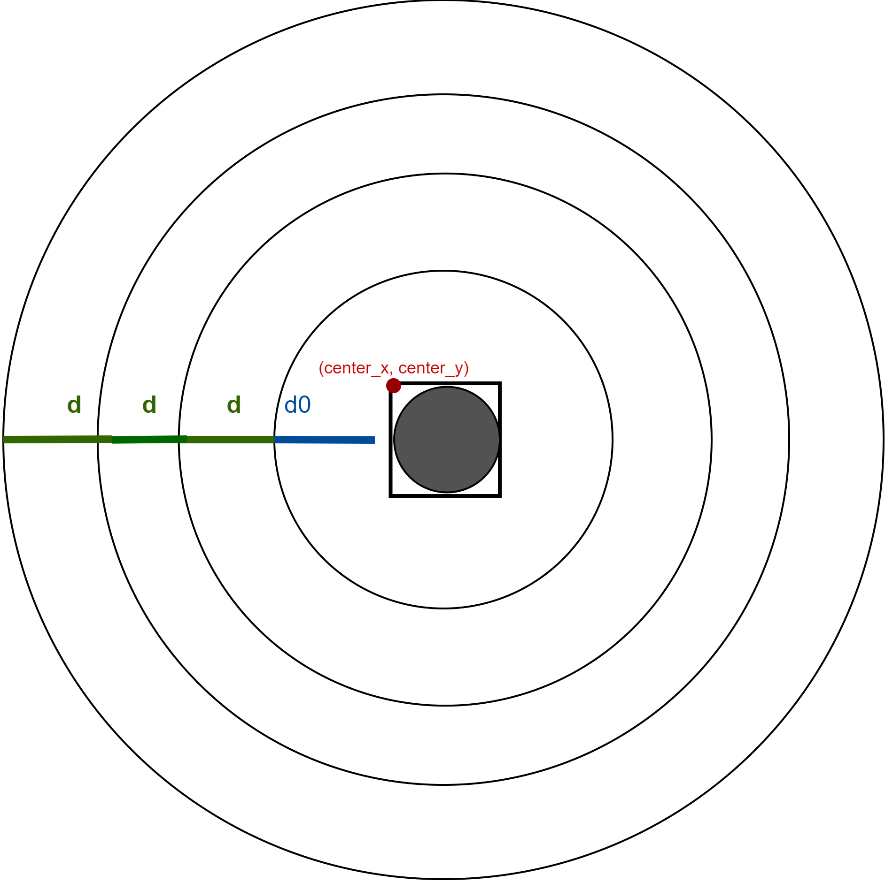
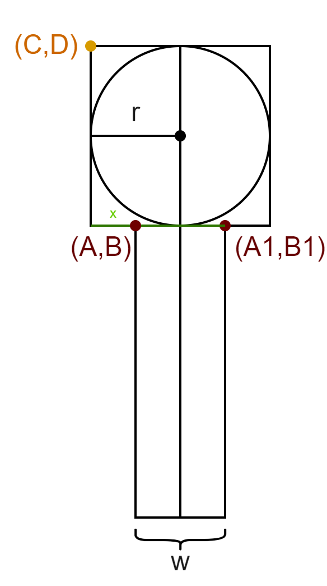
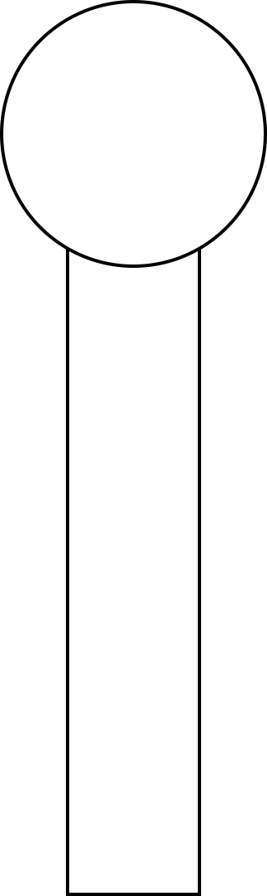
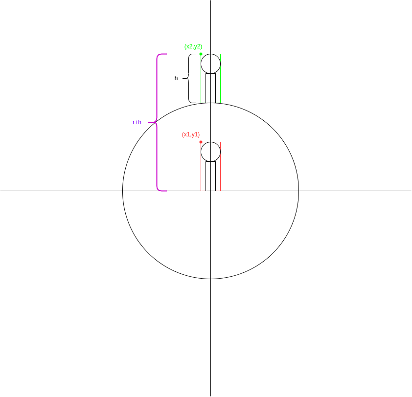
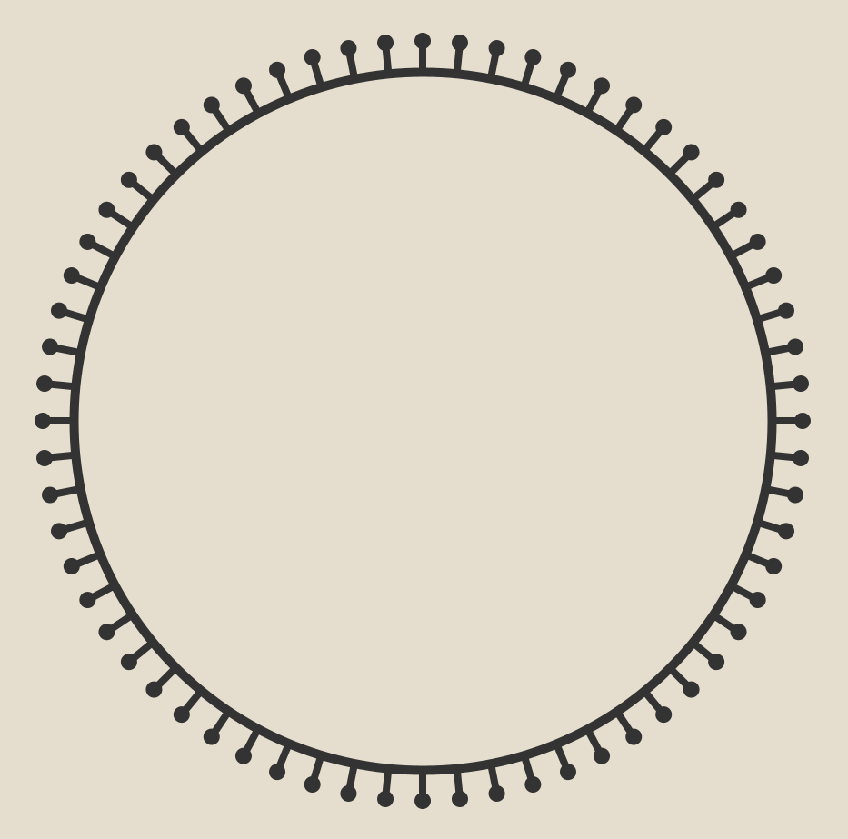

# A graphical pattern with Java

This is a graphical pattern I did as homework for the Computer Graphics class at my university. Running the program gives us the following pattern, with which the user can play around with the slider for making the pattern bigger or smaller. Execute the program by running the main method from PatternTest class.

 

 
Rendering was accomplished by using Area and AffineTransform classes from Java 2D package.  Most of the work had to do with figuring out the coordinates of the objects which are explained below. 

## Approaching the problem 

We will call the sticks with circles above them around circles lollipops. We need a method that draws the $n-th$ pattern of the figure, so the $n-th$ circle of the pattern with $f(n)$ lollipops around it. The algorithm follows:

1. Draw the $n-th$ circle of the pattern.
2. Draw a lollipop above the circle.
3. Keep rotating the lollipop and drawing it around the circle.

The class which models a lollipop is Lollipop.java and the class that has this algorithm is Pattern.java. The latter class calculates the position of circles and lollipops, such as the radius of the $n-th$ circle, rising the lollipop above the circle, and rotating the lollipop around it.

## Drawing the n-th circle of the pattern

The concentric circles are all equally distanced from one another with the distance $d$. We write with $r_n$ the radius of the $n-th$ circle and we get the general formula for calculating it's radius.

$$r_n = d+r_{n-1} = 2d +r_{n-2} = ... = (n-1)d +r_1 $$

We can see that the first circle(*the one filled with color*) has a distance $d0$ (not neccesarily $d$) from the second circle so:

$$r_1 = d_0+r_0$$

Plugging $r_1$ into the first equation we get:

$$r_n=(n-1)d+d_0+r_0$$

## Modeling a lollipop 

We will call the rectangle of the lollipop a stick and the circle above it a pop (I was so excited to call it pop). We want to draw the lollipop such that the $Oy$ of the coordinate system is a symmetric axis of the stick. Let $r$ be the radius of the circle,  $w$ and $h$ the width and the height of the stick respectively. Now we figure out the coordinates.

 

Clearly the cordinates of point $(A,B)$ are $(-w/2,h)$. Since point $(C,D)$  is the upper left corrner of the circumscribed rectangle of the circle we 
$(C,D) = (-r,B+2r) = (-r,h+2r)$.

To give the llollipop the look as  above, the coordinate D was shifted down for a few pixels.

## Moving the lollipop to the top of the circle

The next step is to move this lollipop to the top of the circle. Since $Oy$ is a symmetrical axis of both the lollipop and the circle, we only have to shift the lollipop up for $r$ units.

The cordinates of the rised up lollipop are:

$$ x_2 = x_1 $$

$$ y_2 = y_1+r = h+r $$

## Rotoating the lollipop around the circle 

The $n-th$ circle has $f(n)$ lollipops around it, and this function is chosen to be:

$$f(n) = 8(n+1)$$

The angle which one lollipop should be rotoated and be drawn is $2pi/f(n)$. The affine transform class was used to rotoate the lollipop around the circle. Then inside a for loop, we rotoate the lollipop and draw it. 
The following code rotoates the lollipop and renders it.

               AffineTransform r = new AffineTransform();
               int n0 = f(n);
               r.rotate(2 * Math.PI / n0);
               for (int i = 0; i < n0; i++) {
                    lollipopArea = lollipopArea.createTransformedArea(r); 
                    g2.fill(lollipopArea);
               }

It was important rotoating the lollipop and then drawing it, rather then adding all the lollipops together into one Area and then rendering it beacuse this approach had super slow excectution time. 

## Drawing the pattern 

Since our method draws the $n-th$ pattern of the circle, to get the pattern as shown in the gif above, we have to enter in a for loop as follows:

          for (int i = 0; i < circles; i++) {
               Pattern.drawPattern(center_x, center_y, center_diameter, i, g2);
          }
 
It is also possible just to draw for example only the seventh  circle of the pattern with the lollipops around it as shown in the image below: 
 
   

Back to our for loop, if circles parameter equaled three, then we would get the following pattern

   

